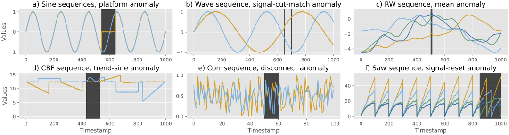

<div align="center">

<h1 align="center">multivariate Time Series Anomaly Detection Benchmark Suites</h1>
<p>
Benchmark Suites for Anomaly Detection on Multivariate Time Series
</p>
</div>


## Features

- Two benchmark suites
  1) Fully synthetic benchmark suite 
  2) Semi-realistic benchmark suite
- Only multivariate sequences
- Expressive and compact 
- Full knowledge about the sequences and the anomalies
- Compatible to [TimeEval](https://github.com/HPI-Information-Systems/TimeEval)

### Fully synthetic benchmark suite samples



### Semi-realistic benchmark suite sample


## Usage

### Sequence iterator

Use a file iterator to load the sequences or the build in loading functionality with caching capabilities. 

```python
from loading import load_all_stored_datasets

generator = load_all_stored_datasets("fsb")  # or srb
for gen in generator:
    group, parameters, train_sequence, test_sequence = gen
    ...
```

- `group` contains the name of the loaded sequence and may contain `no-anomaly` in the end, which means that the training sequences does not contain any anomaly and is for unsupervised and semi-supervised algorithms.
- `parameters` contains the generation configuration and varies between the GutenTAG generated ones and the added.
- `train_sequence` is a Pandas DataFrame containing the sequence for training with the column structure `timestamp,value-0,value-1,…,is_anomaly` and is fully compatible to GutenTAG and TimeEval
- `test_sequence` is a Pandas DataFrame containing the sequence for testing with the column structure `timestamp,value-0,value-1,…,is_anomaly` and is fully compatible to GutenTAG and TimeEval

### Compatibility note

The semi-realistic benchmark suite is not fully compatible with the TimeEval framework because the sequences include additional information. They include in the which channel contains the anomaly and the magnitude of the artificial change. This information is automatically filtered out by using the provided loader in `loading.py`.

---

### Generate sequences

Executing the `main.py` file generates the sequences that are not covered via the [GutenTAG framework](https://github.com/HPI-Information-Systems/GutenTAG): 
```shell
usage: main.py [-h] [--suite {FSB,SRB}] [--save SAVE] [--plot PLOT] [--interactive INTERACTIVE] [--remove_orphan_only REMOVE_ORPHAN_ONLY]

optional arguments:
  -h, --help            show this help message and exit
  --suite {FSB,SRB}     Name name of the benchmark suite to generate: 'FSB' or 'SRB'
  --save SAVE           Save the generated sequences: 'yes' or 'no'
  --plot PLOT           Render each sequences after generation: 'yes' or 'no'
  --interactive INTERACTIVE
                        Generate sequences interactively with with user input to continue: 'yes' or 'no'
  --remove_orphan_only REMOVE_ORPHAN_ONLY
                        Remove orphan sequences only: 'yes' or 'no'
```

Generate the GutenTAG framework covered sequences:
```shell
pip install timeeval-gutenTAG
gutenTAG --config-yaml GutenTAG-config.yaml --seed 11
```
It is required to have GutenTAG installed on the system to generate the sequences.

## Generate new sequences

### Changing parameters

To generate new sequences that are covered by the GutenTAG framework, then please follow their documentation and update the configuration in [GutenTAG-config.yaml](GutenTAG-config.yaml) accordingly and generate the sequences with the command above.

To generate new sequences that ere not covered by the GutenTAG framework, then update parameterization in the file [generators.py](generators.py) and execute the [main.py](main.py) after. Be aware that not all generators configured in the `generator.py` file are generated. They need to be added to the `main.py` file to be generated.

## Citation

If you use mTADS in your project or research, please cite our demonstration paper:


```bibtex
@article{Baumgartner2024TmTADS,
  title = {mTADS: Multivariate Time Series Anomaly Detection Benchmark Suites},
  author = {Baumgartner, David and Langseth, Helge and Ramampiaro, Heri and Engø-Monsen, Kenth},
  date = {2024}
}
```
